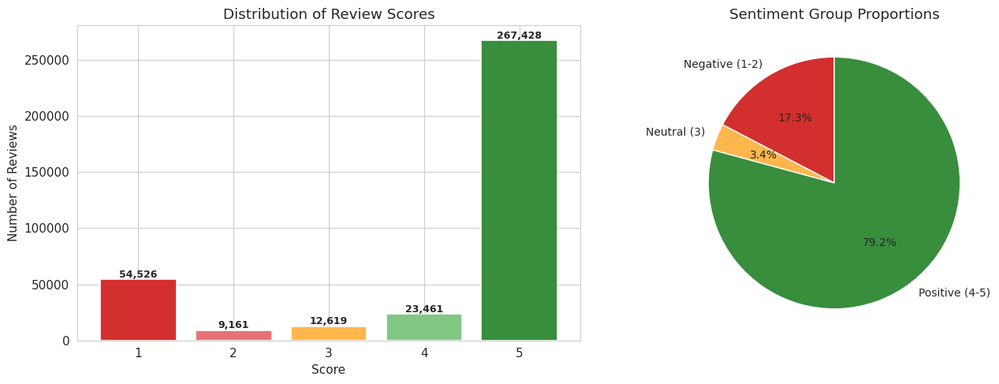
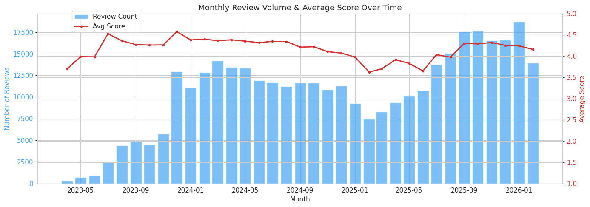
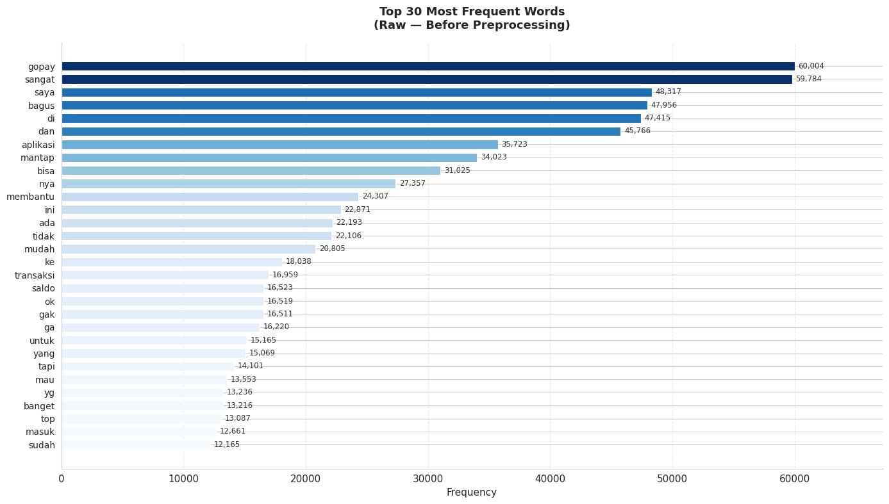
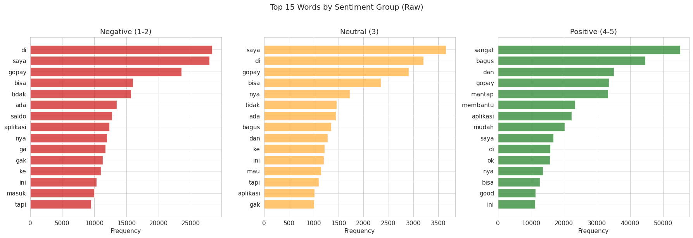
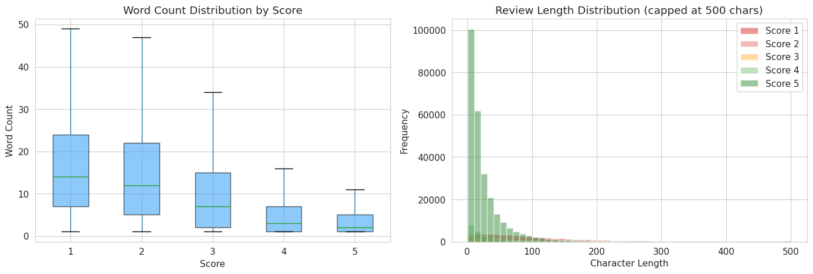
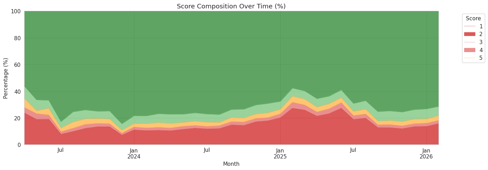
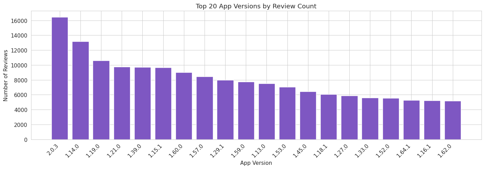
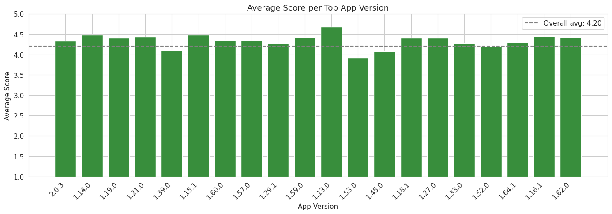
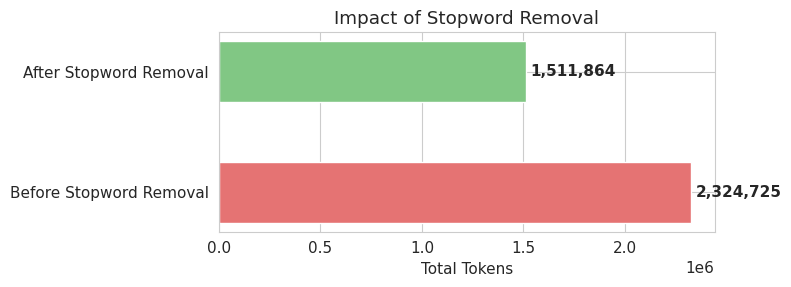

# GoPay Sentiment Review Analysis

A Natural Language Processing project that scrapes, processes, and classifies user reviews of the **GoPay** digital payment app from the Google Play Store. The pipeline is built specifically for informal Bahasa Indonesia, handling the slang-heavy, abbreviation-dense writing style that characterizes Indonesian app reviews.

| | |
| --- | --- |
| **Name** | Muhammad Razan Parisya Putra |
| **NRP** | 5026231174 |

---

## Background

GoPay is embedded into the Gojek super-app and serves as one of the most frequently used digital wallets in Indonesia, covering use cases from ride payments to merchant transactions and peer-to-peer transfers. The volume of user reviews on the Play Store reflects the scale of its adoption, but raw star ratings only tell part of the story. The actual text of a review often contains nuance that a single integer score cannot capture: a 3-star review might describe a feature the user likes while complaining about a specific bug, or a 1-star review might be directed at a temporary outage rather than the product itself.

This project builds a pipeline that goes from raw scraped reviews to trained sentiment classifiers, making it possible to analyze that nuance at scale using multiple machine learning approaches and text representations.

One of the core technical challenges here is the language itself. Reviews are written in informal Bahasa Indonesia, which is structurally different from formal Indonesian and entirely different from English. Words like `gak`, `bgt`, `udh`, and `yg` are ubiquitous in app reviews but would be treated as noise by any standard English NLP library. The preprocessing pipeline addresses this directly using Indonesian-specific tools.

---

## Repository Structure

```
GopaySentimentReview/
├── Dataset/
│   ├── gopay_reviews_raw.csv
│   ├── gopay_reviews_clean.csv
│   └── gopay_reviews_sentiment.csv
│
├── Images/
│   ├── Distribution-of-Reviews-Scores.png
│   ├── Monthly-Review-Volume-and-Average-Score-Over-Time.png
│   ├── Most-Frequent-Words-Raw.png
│   ├── Words-by-Sentiment-Group-Raw.png
│   ├── Word-Count-Distribution-by-Score-and-Review-Length-Distribution.png
│   ├── Score-Composition-Over-Time.png
│   ├── App-Versions-by-Review-Count.png
│   ├── Average-Score-App-Version.png
│   ├── Impact-of-Stopwords-Removal.png
│   └── Sentiment-Label-Distribution.png
│
├── Notebook/
│   ├── 01_Gopay_Review_Scrapping.ipynb
│   ├── 02_Gopay_Review_EDA.ipynb
│   ├── 03_Gopay_Review_Preprocessing.ipynb
│   ├── 04_Gopay_Review_Sentiment_Analysis.ipynb
│   └── 05_Gopay_Review_TF_IDF.ipynb
│
└── README.md
```

---

## Table of Contents

- [Background](#background)
- [Repository Structure](#repository-structure)
- [Pipeline](#pipeline)
- [Notebooks](#notebooks)
- [Datasets](#datasets)
- [Preprocessing Design](#preprocessing-design)
- [Modeling Approach](#modeling-approach)
- [Visualizations](#visualizations)
- [Setup and Installation](#setup-and-installation)
- [References](#references)

---

## Pipeline

The project runs in five sequential stages. Each stage produces an output that feeds directly into the next.

```
Scraping  -->  EDA  -->  Preprocessing  -->  Sentiment Analysis  -->  Classification
    |            |             |                     |                      |
raw CSV     patterns      clean CSV           scored CSV            model results
```

No stage should be skipped. The preprocessing output is a dependency for both the sentiment and classification notebooks.

---

## Notebooks

### 01 - Scraping

Uses `google-play-scraper` to collect reviews from the GoPay listing on the Google Play Store. For each review, the scraper retrieves the text content, star rating, posting timestamp, app version at the time of writing, thumbs-up count, and developer reply if one exists. The full output is written to `gopay_reviews_raw.csv`.

### 02 - Exploratory Data Analysis

Before any transformation is applied, this notebook surveys the raw data to understand its shape and distributions. Key analyses include the distribution of star ratings across the 1 to 5 scale, monthly review volume plotted against average score to surface periods of user dissatisfaction, the most frequently occurring words in unprocessed review text, word frequency broken down by sentiment group, review length distributions grouped by score, score composition shifts over time, and review volume and average rating segmented by app version. The app version analysis is particularly useful for identifying whether specific releases triggered rating drops.

### 03 - Preprocessing

This is the most technically involved notebook. It applies a full Indonesian NLP pipeline designed for informal text. Each step is sequenced deliberately because the output of one step is the expected input format for the next. The pipeline is described in detail in the [Preprocessing Design](#preprocessing-design) section below.

Output: `gopay_reviews_clean.csv`

### 04 - Sentiment Analysis

Applies TextBlob to compute a polarity score and a subjectivity score for each preprocessed review. Polarity measures whether the text leans positive or negative on a scale from -1.0 to +1.0. Subjectivity measures how opinion-based the text is on a scale from 0.0 to 1.0. The notebook then produces a scatter plot of polarity versus subjectivity with points colored by sentiment class, word clouds for the full corpus and separately for positive and negative reviews, a bar chart of review volume by year, a rating distribution chart, and a stacked bar chart showing how the proportion of positive, neutral, and negative reviews shifts over time.

Output: `gopay_reviews_sentiment.csv`

### 05 - TF-IDF and Classification

Trains five machine learning classifiers using three different text embedding strategies and compares their performance. Classifiers are evaluated on a held-out 20% test set using accuracy, weighted precision, weighted recall, and weighted F1-score. Each classifier-embedding combination produces a classification report and confusion matrix. The final visualization is a grouped bar chart comparing accuracy across all fifteen combinations.

---

## Datasets

### gopay_reviews_raw.csv

The unmodified output of the scraping stage.

| Column | Description | Type |
| --- | --- | --- |
| `reviewId` | Unique review identifier | Object |
| `userName` | Reviewer display name | Object |
| `userImage` | Reviewer profile image URL | Object |
| `content` | Full review text as written by the user | Object |
| `score` | Star rating from 1 to 5 | Integer |
| `thumbsUpCount` | Number of helpful votes the review received | Integer |
| `reviewCreatedVersion` | App version when the review was submitted | Object |
| `at` | Review submission timestamp | Datetime |
| `replyContent` | Developer reply text, where available | Object |
| `repliedAt` | Developer reply timestamp, where available | Datetime |
| `appVersion` | App version field from the scraper | Object |

### gopay_reviews_clean.csv

The output of the preprocessing stage. Columns irrelevant to NLP tasks are dropped and a new column `final_text` is added containing the processed text ready for vectorization.

| Column | Description |
| --- | --- |
| `content` | Original review text, preserved as a reference |
| `score` | Star rating |
| `at` | Review timestamp |
| `thumbsUpCount` | Helpful vote count |
| `replyContent` | Developer reply, if present |
| `sentiment` | Label derived from rating: positive, neutral, or negative |
| `final_text` | Preprocessed text used as model input |
| `tokens_stemmed` | Stemmed tokens stored as a Python list |

### Sentiment Labels

Labels are assigned from the star rating rather than from the text, making them a strong and consistent signal for supervised learning.

| Score | Label |
| --- | --- |
| 1 - 2 | negative |
| 3 | neutral |
| 4 - 5 | positive |

---

## Preprocessing Design

The pipeline is ordered so that each transformation produces cleaner input for the next. Running steps out of order will produce different and generally worse results.

| Step | Tool | What it does |
| --- | --- | --- |
| Drop metadata columns | pandas | Removes `reviewId`, `userName`, `userImage`, `appVersion` |
| Remove null and empty rows | pandas | Drops rows where `content` is null or whitespace-only |
| Deduplicate | pandas | Keeps first occurrence of any duplicated review text |
| Assign sentiment label | custom function | Maps score to positive, neutral, or negative |
| Case folding | str.lower() | Converts all characters to lowercase |
| Text cleaning | regex | Strips URLs, email addresses, emojis, digits, punctuation, and excess whitespace |
| Slang normalization | custom dictionary | Replaces informal abbreviations with their standard Indonesian equivalents |
| Tokenization | NLTK word_tokenize | Splits the cleaned string into a list of word tokens |
| Stopword removal | Sastrawi + custom list | Filters out common Indonesian function words and domain-specific noise terms |
| Stemming | Sastrawi Stemmer | Reduces each token to its morphological root |
| Text reconstruction | str.join | Joins the stemmed token list back into a single string |

### Why Sastrawi and not NLTK or spaCy

Indonesian uses a rich affixation system where a single root word can generate many surface forms through the addition of prefixes and suffixes. The root `bayar` (pay) appears as `pembayaran`, `membayar`, `dibayarkan`, `terbayar`, and so on. NLTK's Porter and Snowball stemmers were designed for English morphology and do not recognize these patterns. Applied to Indonesian text they either leave words untouched or strip characters incorrectly. Sastrawi implements the Nazief-Adriani algorithm, which was developed specifically for Indonesian morphological analysis and correctly handles this affixation system.

### Slang normalization dictionary

The normalization step runs before tokenization and replaces over 70 informal terms with their standard Indonesian equivalents. A sample of the mappings:

| Informal | Standard | Meaning |
| --- | --- | --- |
| `gak`, `ga`, `gk`, `nggak` | `tidak` | not |
| `bgt` | `banget` | very |
| `yg` | `yang` | which / that |
| `udh`, `udah` | `sudah` | already |
| `blm`, `blom` | `belum` | not yet |
| `krn`, `karna` | `karena` | because |
| `bs`, `bsa` | `bisa` | can |
| `klo`, `kalo` | `kalau` | if |
| `tp`, `tpi` | `tapi` | but |
| `jg`, `jga` | `juga` | also |

Without this step, the stemmer receives tokens it cannot recognize and produces uninformative output. The normalization dictionary is applied as a word-level replacement pass over the lowercased, cleaned text.

---

## Modeling Approach

### Text Representations

Three embedding strategies are compared. Each produces a different representation of the same text, and classifiers are trained and evaluated separately on each one.

| Strategy | Vector Type | Size | Notes |
| --- | --- | --- | --- |
| TF-IDF | Sparse | 5,000 features | Term frequency weighted by rarity across the corpus |
| USE | Dense | 512 dimensions | Sentence-level embeddings from Google's Universal Sentence Encoder |
| TF-IDF + USE | Dense | 5,512 dimensions | TF-IDF sparse matrix converted to dense, then horizontally concatenated with USE |

The combination strategy works by calling `.toarray()` on the TF-IDF sparse matrix before concatenating it with the USE embedding matrix using `np.hstack`. This produces a single dense feature matrix that carries both keyword-level and semantic-level information.

### Classifiers

| Classifier | Configuration |
| --- | --- |
| Linear SVM | LinearSVC, max_iter=2000 |
| Logistic Regression | max_iter=1000, multinomial |
| Naive Bayes | MultinomialNB, TF-IDF only |
| XGBoost | multi:softmax objective, mlogloss eval metric |
| Random Forest | 100 estimators, max_depth=3, bootstrap sampling |

Naive Bayes is only applied with TF-IDF features. MultinomialNB requires all feature values to be non-negative, and USE embeddings contain negative values that violate this constraint. Attempting to use MultinomialNB with USE or TF-IDF + USE will raise an error, so those combinations are intentionally excluded.

### Evaluation Protocol

The dataset is split 80/20 into training and test sets using stratified sampling to preserve the class distribution in both partitions. For each classifier-embedding pair, the following metrics are computed on the test set:

- Accuracy
- Precision (weighted average across classes)
- Recall (weighted average across classes)
- F1-score (weighted average across classes)
- Per-class precision, recall, and F1 from the classification report
- Confusion matrix

---

## Visualizations

*Distribution of Review Scores:*



This shows how user ratings are distributed across the 1 to 5 scale. Most review datasets for popular apps are bimodal, with high concentrations at 1 and 5. Understanding this skew is important for interpreting class imbalance in the sentiment labels.

---

*Monthly Review Volume and Average Score Over Time:*



Plotting volume and average score on the same time axis can reveal correlations between review spikes and rating drops, often linked to app updates, outages, or policy changes.

---

*Most Frequent Words in Raw Reviews:*



A frequency analysis of the unprocessed text. At this stage the most common terms are typically stopwords and slang, which motivates the preprocessing steps that follow.

---

*Top Words by Sentiment Group:*



Word frequency broken down by positive, neutral, and negative groups. Comparing these distributions shows which terms are distinctive to each class before preprocessing removes the noise.

---

*Word Count Distribution by Score and Review Length Distribution:*



Review length varies substantially across ratings. Low-score reviews tend to be longer and more detailed, while high-score reviews are often short and affirmative.

---

*Score Composition Over Time:*



A stacked view of how the proportion of each star rating changes over time. This makes it easier to see periods when negative reviews increased as a share of total volume.

---

*App Versions by Review Count:*



Shows which app versions generated the most reviews. High review counts for a specific version can indicate that the release attracted significant user attention, positive or negative.

---

*Average Score by App Version:*



Average star rating per app version. When read alongside the review count chart, low-rated high-volume versions are candidates for closer textual analysis.

---

*Impact of Stopword Removal:*



Compares total token count before and after stopword removal to show how much noise the Sastrawi stopword list eliminates from the corpus.

---

*Sentiment Label Distribution:*


Distribution of the three sentiment classes after labeling from star ratings. The class balance here directly affects how classifier performance should be interpreted.

---

## Setup and Installation

The notebooks are designed for **Google Colab**. Datasets should be placed in Google Drive at the following path:

```
/content/drive/MyDrive/Tugas 1/Dataset/
```

To run locally, a standard Jupyter environment with Python 3.10 or higher works as well.

**Install all dependencies:**

```bash
pip install pandas numpy matplotlib seaborn plotly missingno nltk Sastrawi emoji textblob wordcloud scikit-learn xgboost tensorflow tensorflow-hub google-play-scraper
```

**Download NLTK data:**

```python
import nltk
nltk.download('punkt')
nltk.download('punkt_tab')
nltk.download('stopwords')
nltk.download('words')
nltk.download('wordnet')
```

**Clone and run:**

```bash
git clone https://github.com/mhmdrazn/GopaySentimentReview.git
cd GopaySentimentReview
jupyter notebook
```

Run notebooks in order from 01 to 05. Each notebook expects the CSV output of the previous notebook to already exist in the Dataset folder.

---

## References

- google-play-scraper by JoMingyu: https://github.com/JoMingyu/google-play-scraper
- PySastrawi (Nazief-Adriani stemmer for Indonesian): https://github.com/har07/PySastrawi
- Universal Sentence Encoder v4 on TensorFlow Hub: https://tfhub.dev/google/universal-sentence-encoder/4
- Sentiment Analysis on IMDB by FarhanaTeli: https://github.com/FarhanaTeli/Sentiment_Analysis_IMDB
- TF-IDF reference implementation by Wittline: https://github.com/Wittline/tf-idf

