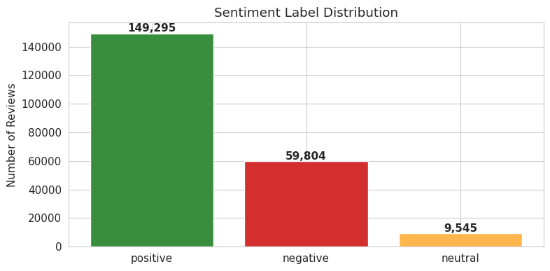

# GoPay Sentiment Review Analysis

A Natural Language Processing project that scrapes, processes, and classifies user reviews of the **GoPay** digital payment app from the Google Play Store. The pipeline is built specifically for informal Bahasa Indonesia, handling the slang-heavy, abbreviation-dense writing style that characterizes Indonesian app reviews.

| Name | Muhammad Razan Parisya Putra |
|------|-------------------------------|
| NRP  | 5026231174                   |

---


## Background

GoPay is embedded into the Gojek super-app and serves as one of the most frequently used digital wallets in Indonesia, covering use cases from ride payments to merchant transactions and peer-to-peer transfers. The volume of user reviews on the Play Store reflects the scale of its adoption, but raw star ratings only tell part of the story. The actual text of a review often contains nuance that a single integer score cannot capture: a 3-star review might describe a feature the user likes while complaining about a specific bug, or a 1-star review might be directed at a temporary outage rather than the product itself.

This project builds a pipeline that goes from raw scraped reviews to trained sentiment classifiers, making it possible to analyze that nuance at scale using multiple machine learning approaches and text representations.

One of the core technical challenges here is the language itself. Reviews are written in informal Bahasa Indonesia, which is structurally different from formal Indonesian and entirely different from English. Words like `gak`, `bgt`, `udh`, and `yg` are ubiquitous in app reviews but would be treated as noise by any standard English NLP library. The preprocessing pipeline addresses this directly using Indonesian-specific tools.

---

## Week Summary

### Week 2: Data Scraping & EDA
Pengumpulan 367,195 review GoPay dari Google Play Store dan analisis eksploratif awal (distribusi rating, tren temporal, analisis teks mentah).

### Week 3: Preprocessing, Stopwords, & Sentiment
Pipeline preprocessing 16 langkah untuk Bahasa Indonesia informal, analisis stopwords dengan pendekatan 3+1 layer, dan sentiment scoring menggunakan TextBlob.

### Week 4: Bag of Words & TF-IDF
Feature extraction menggunakan BoW dan TF-IDF, analisis regex untuk positive/negative signals, dan perbandingan 13 kombinasi classifier-embedding untuk klasifikasi sentimen. Termasuk tugas tambahan TF-IDF (Danantara, Sentence Manchester, Artikel News).

---

## Repository Structure

```
repository/
|
|-- Week 2 - Data Scraping & EDA/
|   |-- notebooks/
|   |   |-- 1-Gopay-Review-Scrapping.ipynb
|   |   |-- 2-Gopay-Review-EDA.ipynb
|   |-- images/
|   |-- README.md
|
|-- Week 3 - Preprocessing & Stopwords/
|   |-- notebooks/
|   |   |-- 3-Gopay-Review-Preprocessing.ipynb
|   |   |-- 4-Gopay-Review-Stopwords-Analysis.ipynb
|   |   |-- 5-Gopay-Review-Sentiment-Analysis.ipynb
|   |-- images/
|   |-- README.md
|
|-- Week 4 - Bag of Words & TF-IDF/
|   |-- notebooks/
|   |   |-- 6-Gopay-Review-BoW.ipynb
|   |   |-- 7-Gopay-Review-TFIDF.ipynb
|   |   |-- Tugas-1A-TFIDF-Danantara.ipynb
|   |   |-- Tugas-1B-TFIDF-Sentence-Manchester.ipynb
|   |   |-- Tugas-1C-TFIDF-Artikel-News.ipynb
|   |-- images/
|   |-- README.md
|
|-- README.md
```

---

## Table of Contents

- [Background](#background)
- [Repository Structure](#repository-structure)
- [Pipeline](#pipeline)
- [Notebooks](#notebooks)
- [Datasets](#datasets)
- [Preprocessing Design](#preprocessing-design)
- [Sentiment Analysis](#sentiment-analysis)
- [Modeling Approach](#modeling-approach)
- [Visualizations](#visualizations)
- [Setup and Installation](#setup-and-installation)
- [References](#references)

---

## Pipeline

The project runs in five sequential stages. Each stage produces an output that feeds directly into the next.

```
[Scraping] --> [EDA] --> [Preprocessing] --> [Stopwords] --> [Sentiment Analysis] --> [BoW] --> [TF-IDF + Classifier]
   NB 1         NB 2        NB 3              NB 3b             NB 6                  NB 4         NB 5
 367,195      367,195     209,311           209,311            209,311               209,311       60,000
 reviews      reviews     reviews           reviews            reviews               reviews      (sampled)
```

No stage should be skipped. The preprocessing output is a dependency for both the sentiment and classification notebooks.

---

## Notebooks

| Notebook | Nama | Input | Output |
|----------|------|-------|--------|
| NB 1 | Scraping | Google Play API | `gopay_reviews_raw.csv` (367,195 rows) |
| NB 2 | EDA | `gopay_reviews_raw.csv` | Visualisasi + insights |
| NB 3 | Preprocessing | `gopay_reviews_raw.csv` | `gopay_reviews_cleandata.csv` (209,311 rows) |
| NB 4 | Stopwords Analysis | `gopay_reviews_cleandata.csv` | Analisis stopwords + noise words |
| NB 5 | Sentiment Analysis | `gopay_reviews_cleandata.csv` | `gopay_reviews_sentiment.csv` (209,311 rows) |
| NB 6 | Bag of Words | `gopay_reviews_sentiment.csv` | BoW matrix + vocabulary + regex analysis |
| NB 7 | TF-IDF + Classifier | `gopay_reviews_sentiment.csv` | Model comparison (13 kombinasi) |

## Datasets

The dataset can be accesseed (here)(https://drive.google.com/drive/folders/1M6dvMwpy7cZbA3AmOSviAhOJ-TsRNLTi?usp=sharing)

### gopay_reviews_raw.csv

The unmodified output of the scraping stage.

| Column | Description | Type |
| --- | --- | --- |
| `reviewId` | Unique review identifier | Object |
| `userName` | Reviewer display name | Object |
| `userImage` | Reviewer profile image URL | Object |
| `content` | Full review text as written by the user | Object |
| `score` | Star rating from 1 to 5 | Integer |
| `thumbsUpCount` | Number of helpful votes the review received | Integer |
| `reviewCreatedVersion` | App version when the review was submitted | Object |
| `at` | Review submission timestamp | Datetime |
| `replyContent` | Developer reply text, where available | Object |
| `repliedAt` | Developer reply timestamp, where available | Datetime |
| `appVersion` | App version field from the scraper | Object |

### gopay_reviews_clean.csv

The output of the preprocessing stage. Columns irrelevant to NLP tasks are dropped and a new column `final_text` is added containing the processed text ready for vectorization.

| Column | Description |
| --- | --- |
| `content` | Original review text, preserved as a reference |
| `score` | Star rating |
| `at` | Review timestamp |
| `thumbsUpCount` | Helpful vote count |
| `replyContent` | Developer reply, if present |
| `sentiment` | Label derived from rating: positive, neutral, or negative |
| `final_text` | Preprocessed text used as model input |
| `tokens_stemmed` | Stemmed tokens stored as a Python list |

### Sentiment Labels

Labels are assigned from the star rating rather than from the text, making them a strong and consistent signal for supervised learning.

| Score | Label |
| --- | --- |
| 1 - 2 | negative |
| 3 | neutral |
| 4 - 5 | positive |

---

## Preprocessing Design

The pipeline is ordered so that each transformation produces cleaner input for the next. Running steps out of order will produce different and generally worse results.

| Step | Tool | What it does |
| --- | --- | --- |
| Drop metadata columns | pandas | Removes `reviewId`, `userName`, `userImage`, `appVersion` |
| Remove null and empty rows | pandas | Drops rows where `content` is null or whitespace-only |
| Deduplicate | pandas | Keeps first occurrence of any duplicated review text |
| Assign sentiment label | custom function | Maps score to positive, neutral, or negative |
| Case folding | str.lower() | Converts all characters to lowercase |
| Text cleaning | regex | Strips URLs, email addresses, emojis, digits, punctuation, and excess whitespace |
| Slang normalization | custom dictionary | Replaces informal abbreviations with their standard Indonesian equivalents |
| Tokenization | NLTK word_tokenize | Splits the cleaned string into a list of word tokens |
| Stopword removal | Sastrawi + custom list | Filters out common Indonesian function words and domain-specific noise terms |
| Stemming | Sastrawi Stemmer | Reduces each token to its morphological root |
| Text reconstruction | str.join | Joins the stemmed token list back into a single string |

### Why Sastrawi and not NLTK or spaCy

Indonesian uses a rich affixation system where a single root word can generate many surface forms through the addition of prefixes and suffixes. The root `bayar` (pay) appears as `pembayaran`, `membayar`, `dibayarkan`, `terbayar`, and so on. NLTK's Porter and Snowball stemmers were designed for English morphology and do not recognize these patterns. Applied to Indonesian text they either leave words untouched or strip characters incorrectly. Sastrawi implements the Nazief-Adriani algorithm, which was developed specifically for Indonesian morphological analysis and correctly handles this affixation system.

### Slang normalization dictionary

The normalization step runs before tokenization and replaces over 70 informal terms with their standard Indonesian equivalents. A sample of the mappings:

| Informal | Standard | Meaning |
| --- | --- | --- |
| `gak`, `ga`, `gk`, `nggak` | `tidak` | not |
| `bgt` | `banget` | very |
| `yg` | `yang` | which / that |
| `udh`, `udah` | `sudah` | already |
| `blm`, `blom` | `belum` | not yet |
| `krn`, `karna` | `karena` | because |
| `bs`, `bsa` | `bisa` | can |
| `klo`, `kalo` | `kalau` | if |
| `tp`, `tpi` | `tapi` | but |
| `jg`, `jga` | `juga` | also |

Without this step, the stemmer receives tokens it cannot recognize and produces uninformative output. The normalization dictionary is applied as a word-level replacement pass over the lowercased, cleaned text.

---

## Sentiment Analysis

### TextBlob Scoring

TextBlob assigns two scalar scores to each preprocessed review:

| Score | Range | Interpretation |
| --- | --- | --- |
| Polarity | -1.0 to +1.0 | Negative to positive sentiment strength |
| Subjectivity | 0.0 to 1.0 | Objective factual statement to subjective personal opinion |

These scores are used to visualize how the sentiment classes distribute across the polarity-subjectivity space, and to confirm that the label assignments from star ratings align with the text-level sentiment signal.

### Class Distribution

The dataset has a significant class imbalance inherited directly from the rating distribution on the Play Store. Positive reviews dominate the corpus, which affects how classifiers should be evaluated and trained.

| Class | Count | Proportion |
| --- | --- | --- |
| positive | 147,814 | ~68% |
| negative | 59,639 | ~27% |
| neutral | 9,482 | ~4% |

*Sentiment Label Distribution:*



---

## Modeling Approach

### Subsampling Strategy

Because the full dataset exceeds 216,000 rows, training USE embeddings and constructing the TF-IDF + USE combined feature matrix on the full data would require significant compute time and memory (~3.6 GB RAM for the combined array alone). The notebook applies **stratified subsampling** to 60,000 samples, preserving the class distribution proportionally while guaranteeing a minimum of 3,000 samples for the minority neutral class. This makes all three embedding strategies practical to run within a standard Colab session.

### Class Imbalance Handling

Because the positive class dominates (~68%), classifiers trained without correction tend to ignore the neutral class entirely, producing near-zero recall for that class. Two approaches are applied:

- `class_weight='balanced'` on Linear SVM, Logistic Regression, and Random Forest, which adjusts the loss function to penalize errors on minority classes more heavily.
- `compute_sample_weight('balanced')` passed as `sample_weight` to XGBoost during `.fit()`, since XGBoost does not support the `class_weight` parameter directly.

Naive Bayes is not adjusted because MultinomialNB handles class priors implicitly through its probability estimation.

### Text Representations

| Strategy | Vector Type | Dimensions | Notes |
| --- | --- | --- | --- |
| TF-IDF | Sparse | 5,000 | Term frequency weighted by rarity across the corpus. Vectorizer fit on training data only. |
| USE | Dense | 512 | Sentence-level embeddings from Google's Universal Sentence Encoder v4. |
| TF-IDF + USE | Dense | 5,512 | TF-IDF sparse matrix converted to dense via `.toarray()`, then concatenated with USE via `np.hstack`. |

### Classifiers

| Classifier | Configuration |
| --- | --- |
| Linear SVM | `LinearSVC`, `max_iter=2000`, `class_weight='balanced'` |
| Logistic Regression | `max_iter=1000`, `class_weight='balanced'`, `n_jobs=-1` |
| Naive Bayes | `MultinomialNB`, TF-IDF only (requires non-negative features) |
| XGBoost | `multi:softmax`, `tree_method='hist'`, GPU-accelerated when available, `sample_weight` for imbalance |
| Random Forest | 100 estimators, `max_depth=15`, `class_weight='balanced'`, `n_jobs=-1` |

Naive Bayes is excluded from USE and TF-IDF + USE evaluations because `MultinomialNB` requires all feature values to be non-negative. Dense USE embeddings contain negative values that violate this constraint.

### Evaluation Protocol

The 60k sampled dataset is split 80/20 using stratified sampling to preserve class proportions in both partitions. Each classifier-embedding pair is evaluated on the held-out test set using weighted accuracy, precision, recall, F1-score, per-class classification report, and confusion matrix.

---

## Setup and Installation

The notebooks are designed for **Google Colab**. Datasets should be placed in Google Drive at the following path:

```
/content/drive/MyDrive/Tugas 1/Dataset/
```

To run locally, a standard Jupyter environment with Python 3.10 or higher works as well.

**Install all dependencies:**

```bash
pip install pandas numpy matplotlib seaborn plotly missingno nltk Sastrawi emoji textblob wordcloud scikit-learn xgboost tensorflow tensorflow-hub google-play-scraper
```

**Download NLTK data:**

```python
import nltk
nltk.download('punkt')
nltk.download('punkt_tab')
nltk.download('stopwords')
nltk.download('words')
nltk.download('wordnet')
```

**Clone and run:**

```bash
git clone https://github.com/mhmdrazn/GopaySentimentReview.git
cd GopaySentimentReview
jupyter notebook
```

Run notebooks in order from 01 to 05. Each notebook expects the CSV output of the previous notebook to already exist in the Dataset folder.

---

## References

- google-play-scraper by JoMingyu: https://github.com/JoMingyu/google-play-scraper
- PySastrawi (Nazief-Adriani stemmer for Indonesian): https://github.com/har07/PySastrawi
- Universal Sentence Encoder v4 on TensorFlow Hub: https://tfhub.dev/google/universal-sentence-encoder/4
- Sentiment Analysis on IMDB by FarhanaTeli: https://github.com/FarhanaTeli/Sentiment_Analysis_IMDB
- TF-IDF reference implementation by Wittline: https://github.com/Wittline/tf-idf
- Course reference project: https://github.com/divaardeliaa/ScrapReviewReliveApp

