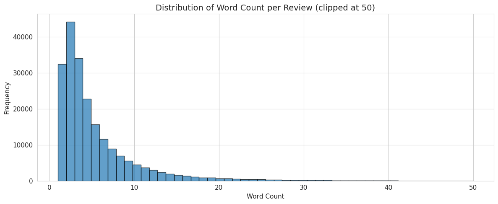
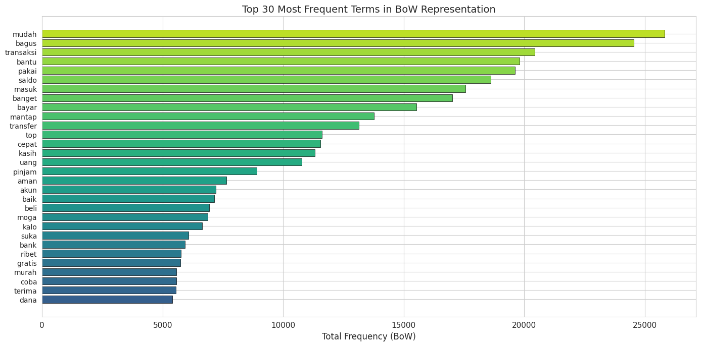
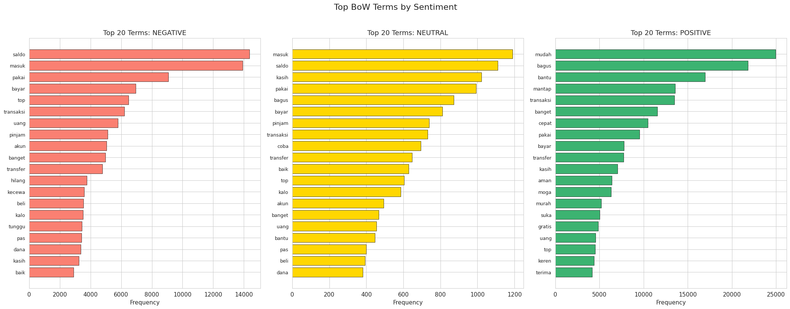
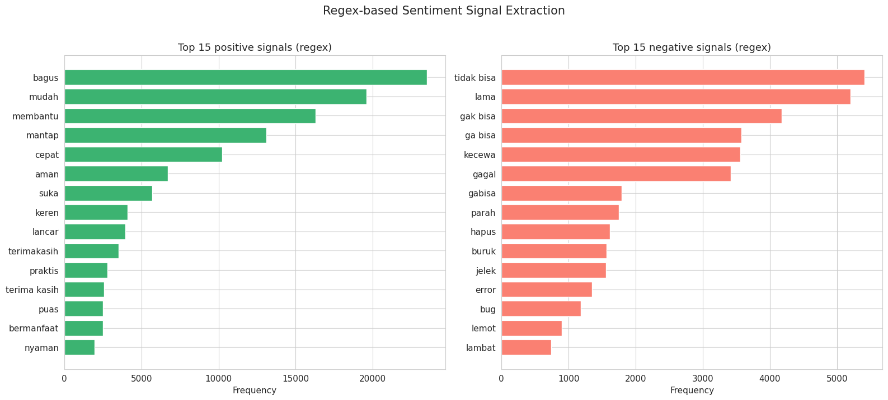
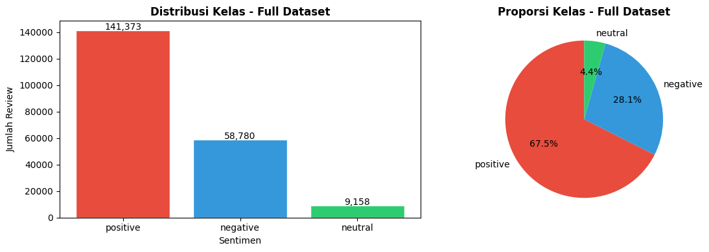
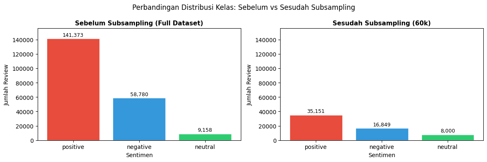
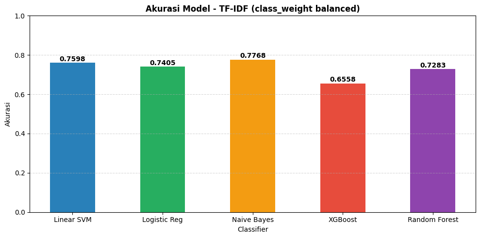
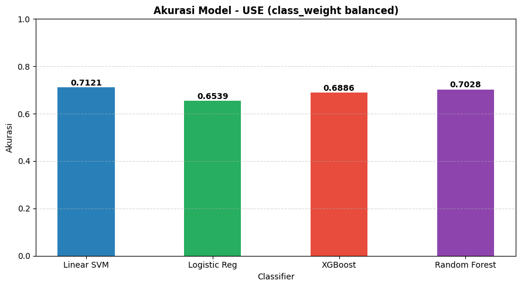
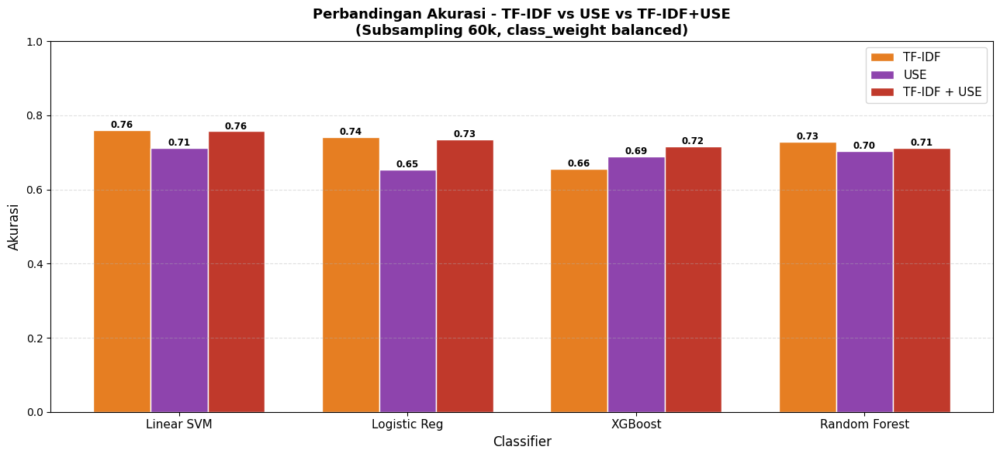

# Week 4: Bag of Words, TF-IDF & Klasifikasi Sentimen

## Ringkasan

Week ini mencakup feature extraction dan klasifikasi sentimen:

- **Bag of Words (BoW):** mengubah teks menjadi matriks angka mentah (frekuensi kata), termasuk analisis regex untuk insights positive/negative
- **TF-IDF + Classifier:** menerapkan bobot TF-IDF di atas BoW, kemudian melatih 13 kombinasi model klasifikasi sentimen
- **Tugas 1A:** TF-IDF Danantara (perhitungan manual vs scikit-learn)
- **Tugas 1B:** TF-IDF Sentence Level Manchester
- **Tugas 1C:** TF-IDF pada artikel berita BBC Indonesia

## Notebook

### 4. Bag of Words (`4-Gopay-Review-BoW.ipynb`)

Mengubah teks review yang sudah dipreprocessing menjadi representasi numerik menggunakan CountVectorizer.

Langkah-langkah:
- Load `gopay_reviews_sentiment.csv`
- Eksplorasi teks bersih (word count distribution, sample review)
- Build BoW model: `CountVectorizer(max_features=5000, min_df=2, max_df=0.95)`
- Inspeksi vocabulary dan term frequency
- Visualisasi top terms (keseluruhan dan per sentimen)
- Analisis regex: identifikasi pola positive/negative signals menggunakan regular expression
- Export matriks BoW dan vocabulary

**Hasil BoW:**
- Documents: 209,311
- Vocabulary: 12,297 kata unik
- Sparsity: 99.96%

### 5. TF-IDF + Classifier (`5-Gopay-Review-TFIDF.ipynb`)

Feature extraction dan klasifikasi sentimen menggunakan tiga strategi embedding dan lima classifier.

Pipeline:
1. Load dataset dan stratified subsampling (60,000 sampel)
2. **Langkah 1 - BoW (CountVectorizer):** teks menjadi matriks angka mentah
3. **Langkah 2 - TF-IDF (TfidfTransformer):** bobot IDF diterapkan di atas matriks BoW
4. Training 5 classifier pada fitur TF-IDF
5. Training 4 classifier pada fitur USE (Universal Sentence Encoder)
6. Training 4 classifier pada fitur TF-IDF + USE (gabungan)
7. Perbandingan akhir semua model

**Classifier yang digunakan:**

| Classifier | TF-IDF | USE | TF-IDF+USE |
|------------|--------|-----|------------|
| Linear SVM | 75.98% | 71.21% | 75.71% |
| Logistic Regression | 74.05% | 65.39% | 73.43% |
| Naive Bayes | **77.68%** | - | - |
| XGBoost | 65.58% | 68.86% | 71.70% |
| Random Forest | 72.83% | 70.28% | 71.21% |

**Model terbaik:** Naive Bayes + TF-IDF (akurasi 77.68%, F1 weighted 73.21%)

### Tugas 1A (`Tugas-1A-TFIDF-Danantara.ipynb`)

Memahami TF-IDF secara mendalam dengan menghitung TF, IDF, dan TF-IDF secara manual (tanpa library) pada corpus bertema Danantara/investasi Indonesia, kemudian membandingkan hasilnya dengan implementasi scikit-learn.

### Tugas 1B (`Tugas-1B-TFIDF-Sentence-Manchester.ipynb`)

Menerapkan TF-IDF pada level kalimat menggunakan 10 kalimat tentang Manchester (kota, sepak bola, musik, universitas, sejarah). Menunjukkan bagaimana kata "manchester" yang muncul di semua kalimat mendapat bobot rendah, sementara kata spesifik mendapat bobot tinggi. Termasuk heatmap TF-IDF.

### Tugas 1C (`Tugas-1C-TFIDF-Artikel-News.ipynb`)

Menerapkan TF-IDF pada artikel berita BBC Indonesia tentang perang dagang AS-China. Artikel dipecah per paragraf sebagai dokumen individual. Menampilkan perbandingan BoW vs TF-IDF dan analisis kata kunci per paragraf.

Sumber: [BBC Indonesia - China peringatkan negara yang buat kesepakatan dengan AS](https://www.bbc.com/indonesia/articles/c1wdzeyr9wyo)

## Images

### Distribution-of-Word-Count-per-Review.png

Histogram distribusi jumlah kata per review setelah preprocessing. Menunjukkan bahwa mayoritas review pendek (1–10 kata).
---

### Top-30-Most-Frequent-Term-in-BoW-Representation.png

Bar chart 30 kata dengan frekuensi tertinggi dalam representasi Bag of Words.
---

### Top-BoW-Terms-by-Sentiment.png

Perbandingan kata paling sering pada masing-masing sentimen (positive, neutral, negative).
---

### Regex-based-Sentiment-Signal-Extraction.png

Identifikasi kata-kata sinyal positif dan negatif menggunakan regex pattern.
---

### Class-Distribution-Full-Dataset.png

Distribusi kelas sentimen pada seluruh dataset, menunjukkan adanya class imbalance.
---

### Distribution-Class-Comparassion-Before-and-After-Subsampling.png

Perbandingan distribusi kelas sebelum dan sesudah stratified subsampling.
---

### Model-Accuration-TF-IDF-Class-Weight-Balanced.png

Perbandingan akurasi model menggunakan fitur TF-IDF dengan class_weight balanced.
---

### Model-Accuration-USE-Class-Weight-Balanced.png

Perbandingan akurasi model menggunakan Universal Sentence Encoder (USE).
---

### Accuration-Comparation-TFIDF-and-USE-and-TFIDF+USE.png

Perbandingan performa semua model pada tiga strategi embedding: TF-IDF, USE, dan kombinasi TF-IDF + USE.

## Dataset

| File | Deskripsi |
|------|-----------|
| `gopay_reviews_sentiment.csv` | Input: data dengan skor sentimen dari Week 3 |
| `bow_matrix.npz` | Output NB 4: sparse matrix BoW |
| `bow_vocabulary.csv` | Output NB 4: daftar vocabulary |

## Tools & Library

- `scikit-learn` - CountVectorizer, TfidfTransformer, Linear SVM, Logistic Regression, Naive Bayes, Random Forest
- `XGBoost` - gradient boosting classifier
- `TensorFlow Hub` - Universal Sentence Encoder
- `scipy` - sparse matrix operations
- `pandas`, `numpy` - manipulasi data
- `matplotlib`, `seaborn` - visualisasi

## Temuan Utama

1. TF-IDF menghasilkan akurasi lebih tinggi dibanding USE pada dataset ini, kemungkinan karena USE dilatih untuk Bahasa Inggris sementara review GoPay menggunakan Bahasa Indonesia informal.
2. Penanganan class imbalance dengan `class_weight='balanced'` meningkatkan recall kelas netral dan negatif.
3. Kombinasi TF-IDF + USE tidak selalu mengalahkan TF-IDF saja, menunjukkan bahwa menambah dimensi fitur tidak otomatis meningkatkan performa.
4. Naive Bayes + TF-IDF menjadi model terbaik (77.68% akurasi), yang masuk akal karena Naive Bayes bekerja baik dengan fitur sparse berdimensi tinggi.
